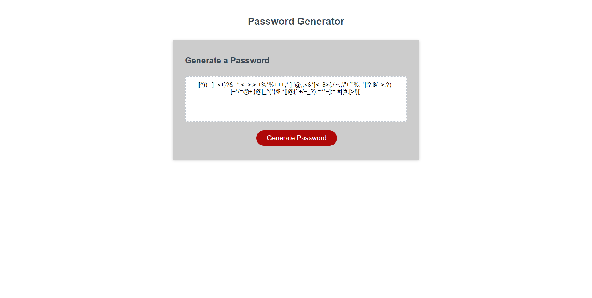

# Password Generator Starter Code
# Criteria for Password

## WHEN I click the button to generate a password THEN I am presented with a series of prompts for password criteria

## WHEN prompted for the length of the password THEN I choose a length of at least 8 characters and no more than 128 characters 

## WHEN asked for character types to include in the password THEN I confirm whether or not to include lowercase, uppercase, numeric, and/or special characters 

## WHEN all prompts are answered THEN a password is generated that matches the selected criteria 

## WHEN the password is generated THEN the password is displayed in a window alert and written to the page in box.

### Screenshot

### Deployed Application
https://brian-nelson10.github.io/Password/